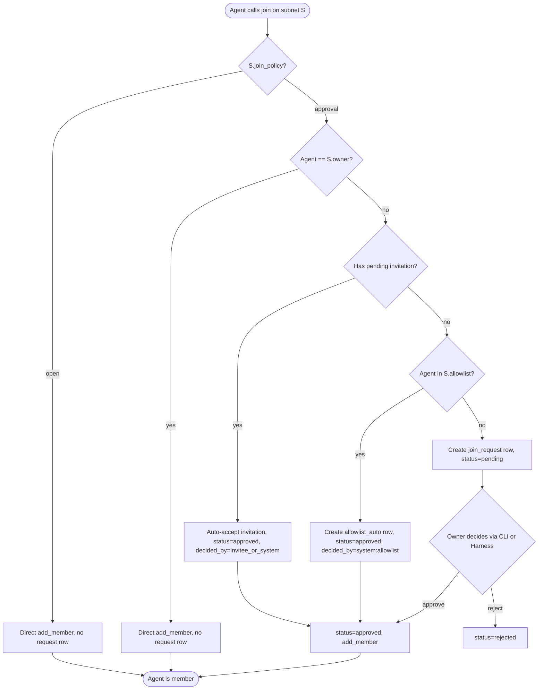
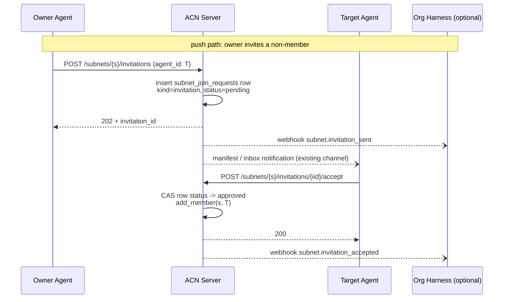

# ADR-0004: Subnet join policy

- **Status**: Proposed
- **Date**: 2026-05-18
- **Decision drivers**: real access control for "private" subnets,
  minimal new surface area, three approval-entry paths unified into
  one auditable primitive, compatibility with ADR-0003 single-layer
  nesting, Org Harness extensibility via webhooks rather than
  synchronous decision protocols.

## Context

ACN's `Subnet` entity has carried an `is_private: bool` field since
day one. The field reads as access control but in fact only controls
**discoverability**, not **join admission**. A direct code audit
confirms the gap:

1. `acn/core/entities/subnet.py` exposes `is_private` (L32) and a
   `requires_authentication()` helper (L107-109) that returns
   `self.is_private and bool(self.security_config)`. The helper is
   never called from the join path.
2. `acn/routes/_subnet_membership.py::do_join_subnet` (L64-194) — the
   single shared join handler used by both the legacy
   `/api/v1/subnets/{agent_id}/subnets/...` routes and the canonical
   `/api/v1/agents/{agent_id}/subnets/...` routes — checks only:
   - the caller's API key matches the path `agent_id` (`_require_self`),
   - the subnet exists,
   - if the subnet is an ADR-0003 child, the caller is a member of
     the parent (`REASON_NOT_PARENT_MEMBER`).

   `subnet.is_private` is never read. There is no admission gate, no
   approval queue, no allowlist check.
3. `acn/services/subnet_service.py::list_public_subnets` (L285-323) is
   the **sole** consumer of `is_private`: it filters out
   `subnet.is_private == True` from the directory shown to anonymous
   callers (L323). That is the entirety of the "private" feature.

The user-visible symptom: any registered agent that knows or guesses a
subnet_id can join a "private" subnet by issuing a single
`POST /api/v1/agents/{agent_id}/subnets/{subnet_id}` call. The
"private" naming sets an expectation of admission control that the
implementation does not honour. This is a semantic bug, not a
configuration mistake.

A second, orthogonal gap surfaced during the same audit. ACN today
offers no primitive for **owner-initiated** subnet membership: there
is no API a subnet owner can call to invite an agent who has not
asked to join. Nor is there a primitive for **pre-approval**
(allowlist) that lets an owner pre-authorise a known agent so that
agent's eventual `join` returns success immediately rather than
queuing for review. Both are recurrent requests for any production
subnet that wants curated membership.

This ADR closes both gaps in a single design pass so that the
approval lifecycle is consistent across all three entry paths
(agent-initiated request, owner-initiated invitation, owner-curated
allowlist auto-approval).

## Considered options

### A. `join_policy` enum decoupled from `is_private` (chosen)

Introduce a new `join_policy: Literal["open", "approval"]` field on
`Subnet`. Keep `is_private` exactly as it is today — a discoverability
toggle that controls inclusion in `list_public_subnets`. The two
fields are orthogonal dimensions:

| visibility | join_policy | behaviour                                           |
|------------|-------------|-----------------------------------------------------|
| `public`   | `open`      | Listed in directory, free join. Today's default.    |
| `public`   | `approval`  | Listed in directory, owner must approve. New.       |
| `private`  | `approval`  | Hidden from directory, owner must approve. New.     |
| `private`  | `open`      | **Rejected at creation time.** See below.           |

The fourth combination `private + open` is the status quo bug: hidden
from directory but joinable by anyone who knows the id. Permitting it
would lock in the false-security semantics that motivated this ADR.
We reject the combination at the entity layer (`__post_init__`) and
the route layer (`POST /api/v1/subnets`).

**Pros**

- Two dimensions, two fields. Each field has one job; future
  extension (e.g. `join_policy="invite_only"`, `"paid"`) touches one
  field. The semantic axes are visible in the data model.
- Backward-compatible read path: every existing call site that reads
  `is_private` continues to behave identically. Only the join path
  gains a new branch on `join_policy`.
- Removes the temptation to overload `is_private` with admission
  semantics. Once the join admission lives in `join_policy`, the
  question "should `is_private` also reject anonymous reads?" can be
  re-asked on its own merits in a later ADR, without coupling the
  two decisions.

**Cons**

- Breaking change for any caller that today created a subnet with
  `is_private=True` and relied on "anyone with the id can join".
  Migration backfills these to `join_policy="approval"`. See the
  separate "Migration strategy" sub-section below.

### B. Add `requires_approval: bool`, keep `is_private` as-is (rejected)

A pure-boolean variant of A: one new field instead of an enum.

**Rejected** because two coupled booleans (`is_private`,
`requires_approval`) admit `2 × 2 = 4` combinations, the same four as
A — but encoded across two scalars rather than one enum on each
dimension. Any future third admission mode (`invite_only`, `paid`,
`token_gated`) forces either a third boolean or a retroactive
migration to an enum. Doing the enum migration now is cheap; doing it
later after the field has shipped is expensive.

### C. Repurpose `is_private` into a tri-state enum (rejected)

Replace `is_private: bool` with
`visibility: Literal["public", "unlisted", "private"]` where `private`
implies approval and `public` / `unlisted` differ only in directory
listing.

**Rejected** because it overloads one field with two orthogonal
concepts (discoverability + admission), reintroducing the exact
coupling this ADR exists to break. It also breaks every existing read
of `is_private` — serialisation, SDK models, harness webhook
payloads, CLI flags. A's two-field model is strictly less invasive.

### Migration strategy

#### A. Aggressive backfill (chosen)

In the same Alembic migration that adds the `join_policy` column,
backfill existing rows with `UPDATE subnets SET join_policy='approval'
WHERE is_private=true`. New rows default to `open`. New creations of
`private + open` are rejected outright.

**Pros**

- One migration, one deploy, no transitional middle state.
- Closes the security-naming gap immediately.
- ACN is v0.x; the public surface allows a labelled breaking change.

**Cons**

- A caller that today depends on "private but anyone can join" will
  start receiving `202 + request_id` from join calls instead of the
  immediate `200 + member`. We mitigate by labelling the version bump
  in CHANGELOG as **BREAKING (subnet semantics: `is_private` now
  implies approval)**.

#### B. Preserve `open` for existing private subnets (rejected)

Backfill `join_policy='open'` for every existing row regardless of
`is_private`. New creations of `private + open` would be permitted to
maintain consistency with the backfill.

**Rejected** because it institutionalises the bug. Existing private
subnets stay joinable by anyone who knows the id, indefinitely. The
window to fix this gap closes as user count grows; postponing the
fix is more expensive than taking the breaking change now.

#### C. Two-phase deprecation-warning then backfill (rejected)

Phase 1 ships the new field with backfill skipped; the entity logs a
deprecation warning for any subnet observed with `is_private=true`
and `join_policy='open'`. Phase 2 (next release) flips the backfill.

**Rejected** as over-engineering for v0.x. ACN does not have a
stable-API contract that would justify a deprecation window. The
deprecation warning would fire on the very rows we want to fix and
yet do nothing to fix them.

### Approval layering

#### A. ACN-native state machine, Harness via webhook callback (chosen)

ACN owns the `pending → approved/rejected/withdrawn` state machine
and exposes owner-facing API endpoints to drive it. ACN emits
webhooks (`subnet.join_requested`, `subnet.invitation_sent`, etc.) on
state transitions. Org Harness implementations may observe these
webhooks and **call back into ACN's existing approve/reject API with
the owner's credentials** to automate decisions. From ACN's
perspective the Harness is just another caller with owner authority;
no new authentication protocol is introduced.

**Pros**

- The primitive (state machine) lives in ACN. Operators without a
  Harness use the CLI to approve and the feature works end-to-end.
- The orchestration (auto-approval policies, escalation, SLA tracking)
  lives in Harness. ACN does not become a policy engine.
- Webhook signature is HMAC-signed already (`X-ACN-Signature`); no
  new transport security work.
- Symmetric with ADR-0003's posture: ACN ships the primitive,
  Harness composes the workflow.

**Cons**

- Harness automation needs an owner-equivalent credential to call
  back. The simplest implementation is "owner gives Harness their
  API key", which trades convenience for blast radius. See the
  Security considerations section for the explicit risk register and
  the follow-up ADR seed for `Subnet capability delegation`.

#### B. Pure Harness orchestration (rejected)

ACN exposes only a raw `pending join` queue read endpoint; all
decision logic lives in Harness, which calls a single "admit /
deny" sync endpoint. ACN's CLI does not directly approve.

**Rejected**. Operators with no Harness deployment would be unable to
approve at all — the CLI would be a hollow shell. The "ACN ships
primitives" principle requires the primitive to be usable
standalone.

#### C. Pure ACN, no webhook (rejected)

ACN owns the state machine and emits no events; Harness must poll
the pending queue.

**Rejected**. Polling at the cardinality of all subnets across all
Harness deployments wastes both sides' resources and produces lag
proportional to the poll interval. ACN already speaks webhooks for
every subnet-scoped activity (`agent.joined_subnet`,
`agent.left_subnet`, plus the task event family); adding three
membership-lifecycle events to the same envelope is a marginal cost.

### Allowlist semantics

#### A. Auto-approve via the same request table (chosen)

When an agent on the allowlist calls `join` on an `approval` subnet,
ACN creates a row in `subnet_join_requests` with `kind='allowlist_auto'`,
`status='approved'`, `decided_by='system:allowlist'`, and returns
`200 + request_id` plus a `via: "allowlist"` discriminator in the
response. The same `subnet.join_approved` webhook fires that owner
approval would have fired, distinguished only by the `decided_by`
value.

**Pros**

- One audit trail for every membership grant. A historical query
  "how did agent X join subnet Y?" returns a row with explicit
  provenance for all three paths (manual approval, accepted
  invitation, allowlist hit).
- The same Harness webhook handler receives all approval events;
  Harnesses do not need a separate "silent membership" event type.
- Future hooks (rate limiting, temporary block, audit hold) attach
  to the `pending → approved` transition once and apply uniformly.

**Cons**

- One row written per allowlist hit. Storage cost is negligible at
  the request cardinality we expect (humans / agents join subnets
  rarely relative to message volume).

#### B. Bypass (no row, direct `add_member`) (rejected)

Allowlist-hit joins skip the request table entirely. Add the agent
to `member_agent_ids` immediately, fire only the existing
`agent.joined_subnet` webhook, leave no `subnet_join_requests` row.

**Rejected**. Three audit trails (allowlist=silent,
invitation=request row, manual=request row) are harder to reason
about than one. Operators investigating membership origin would
need to consult two data sources and infer the third. The cost of
maintaining the asymmetry exceeds the cost of writing one row.

## Decision: Field model

Adopt option A. Add to `acn/core/entities/subnet.py`:

```python
join_policy: Literal["open", "approval"] = "open"
```

Enforce in `__post_init__`:

```python
if self.is_private and self.join_policy == "open":
    raise ValueError(
        f"subnet '{self.subnet_id}' configuration invalid: "
        f"is_private=True requires join_policy='approval' "
        f"(reason=visibility_policy_conflict)"
    )
```

Route layer (`POST /api/v1/subnets`) translates the `ValueError` into
an `ACNHTTPError(ErrorCode.INVALID_REQUEST, 400, details={"reason":
"visibility_policy_conflict"})`. We reuse `INVALID_REQUEST` rather
than minting a dedicated error code to keep the error vocabulary
small; the `details.reason` discriminator is the canonical way to
distinguish validation failures in this codebase (see ADR-0003
`details.reason` enumeration `{parent_not_found, parent_is_reserved,
…}`).

`Subnet.requires_authentication()` is left untouched but becomes
historical: the join admission path no longer consults it. A
follow-up PR may either repurpose `security_config` for something new
or remove the helper; either is out of scope.

`Subnet.to_dict` / `from_dict` round-trip the new field with the same
"missing field defaults to `'open'`" semantics that ADR-0003 used for
its nesting fields — legacy rows in Redis naturally deserialise as
`open` without a backfill, then the entity-layer invariant
synchronises any `is_private=true` row to `approval` on first
service-layer touch. Postgres rows are backfilled inside the
Alembic migration (see Migration section below).

## Decision: Migration

Adopt the aggressive backfill (option A). Ship a single Alembic
migration that (a) adds the `join_policy` column with default
`'open'`, (b) immediately executes
`UPDATE subnets SET join_policy='approval' WHERE is_private=true`,
and (c) creates `subnet_join_requests` and `subnet_allowlist` tables.
Bump the package minor version (e.g. `v0.13.0`) and mark the change
as **BREAKING (subnet semantics: `is_private` now implies approval)**
in `CHANGELOG.md` and `RELEASE_NOTES.md`.

Deployments that combine Postgres and Redis (per `AGENTS.md`,
Postgres is opt-in and Redis is the canonical store; some deployments
run both with Redis as cache) MUST run the Redis backfill script
after the Alembic migration completes. Skipping the Redis backfill
leaves stale `join_policy='open'` reads coming through the cache for
private subnets — the exact "private but joinable by anyone" bug this
ADR exists to fix, transiently re-introduced for the duration of the
TTL window. See the Migration section below for the exact deploy
sequencing.

## Decision: Approval layering

Adopt the hybrid (option A). ACN owns the state machine and the API
surface; Harness opts in by subscribing to webhooks and calling the
public API to act. No synchronous Harness-decides-then-ACN-commits
protocol is introduced. Webhook authenticity continues to rely on
the existing `X-ACN-Signature: sha256=…` HMAC envelope. ACN itself
makes no assumption about Harness availability or response time.

The CLI offers the full owner-side surface (`acn subnet requests
approve`, `acn subnet invitations send`, `acn subnet allowlist add`)
so a deployment without any Harness can operate the feature
end-to-end manually.

## Decision: Three approval entry paths, unified table model

Provide three entry paths into the membership-approval state machine,
all backed by a single physical table:

1. **Join request** (pull): agent calls `join` on an `approval`
   subnet; if neither owner nor allowlisted nor pending-invited, ACN
   creates a `kind='join_request'` row with `status='pending'`.
   Owner decides.
2. **Invitation** (push): owner calls `POST /subnets/{s}/invitations`
   with `{agent_id: T}`; ACN creates a `kind='invitation'` row with
   `status='pending'`. Invitee decides.
3. **Allowlist auto-approval** (pre-auth): owner adds T to the
   subnet's allowlist; when T later joins, ACN creates a
   `kind='allowlist_auto'` row already in `status='approved'` (no
   pending stage). The row exists for audit symmetry, not for a
   decision.

All three are physically stored in **one table**, `subnet_join_requests`,
discriminated by a `kind` column. The reasons for unification:

- A single uniqueness constraint
  (`UNIQUE (subnet_id, agent_id) WHERE status='pending'`) atomically
  prevents the duplicate-pending pathology across kinds. Without
  unification, "owner invites agent T while T already has a pending
  request" would require cross-table lock coordination.
- A single state machine handles all transitions, so the auditing
  vocabulary (`pending`, `approved`, `rejected`, `withdrawn`),
  decided_by tracking, and the webhook event family are uniform.
- Future additions (audit holds, rate limits, capacity caps on
  pending queues) attach to one table.

URL paths are **split into two namespaces** to match operator mental
models — `/join-requests/{id}` for the pull direction, `/invitations/
{id}` for the push direction — but they query the same underlying
table. The path segment validates the `row.kind`: a request id used
against the wrong path returns `404 JOIN_REQUEST_NOT_FOUND` or `404
INVITATION_NOT_FOUND` as appropriate (see API changes section).

`SubnetInvitation` is not a separate entity. It is the row with
`kind='invitation'` in `subnet_join_requests`. The split is
URL-level, not data-level.

Allowlist membership is a separate, simpler concern (a pre-auth
config set with no state machine of its own), so allowlist entries
live in a distinct `subnet_allowlist` table. Its structure mirrors
`acn/routes/allowlist.py`'s agent-to-agent allowlist (`add`,
`remove`, `list`, owner-only access). Allowlist mutation does not
write to `subnet_join_requests`; only the act of joining does.

## Data model

### `Subnet` entity addition

```python
@dataclass
class Subnet:
    # ... existing fields elided ...
    join_policy: Literal["open", "approval"] = "open"

    def __post_init__(self):
        # ... existing invariants elided ...
        if self.is_private and self.join_policy == "open":
            raise ValueError(
                "is_private=True requires join_policy='approval' "
                "(reason=visibility_policy_conflict)"
            )
```

`to_dict` includes `join_policy`. `from_dict` applies the same
two-case legacy tolerance rule the migration uses (see §Migration
and §"Field model" above): on a row that predates ADR-0004 (no
`join_policy` key), `from_dict` auto-upgrades missing
`join_policy` to `"approval"` when `is_private=True` and falls
through to the entity default `"open"` otherwise. This keeps every
Redis read self-consistent during the migration window — a legacy
private subnet reconstructs as `(is_private=True,
join_policy="approval")`, which satisfies the
`__post_init__` invariant, rather than `(is_private=True,
join_policy="open")`, which would refuse to reconstruct and break
every read of a legacy private subnet.

### `SubnetJoinRequest` schema (three-in-one table)

| field           | type                                                              | notes                                                                                                          |
|-----------------|-------------------------------------------------------------------|----------------------------------------------------------------------------------------------------------------|
| `request_id`    | `str` (UUID)                                                      | server-generated                                                                                               |
| `subnet_id`     | `str`                                                             | FK target (not enforced at the entity layer; manual cascade)                                                   |
| `agent_id`      | `str`                                                             | the agent **being admitted** — applicant for `join_request`, invitee for `invitation`, target for `allowlist_auto` |
| `kind`          | `Literal["join_request", "invitation", "allowlist_auto"]`         | discriminator                                                                                                  |
| `status`        | `Literal["pending", "approved", "rejected", "withdrawn"]`         |                                                                                                                |
| `initiated_by`  | `str`                                                             | applicant agent_id / owner agent_id / `"system:allowlist"`                                                     |
| `decided_by`    | `str \| None`                                                     | owner agent_id (approve/reject join_request) / invitee agent_id (accept/reject invitation) / `"system:allowlist"` (auto) / withdrawer (withdrawn) |
| `created_at`    | `datetime` (UTC)                                                  |                                                                                                                |
| `decided_at`    | `datetime \| None`                                                | timestamp of the transition out of `pending`                                                                   |
| `note`          | `str \| None`                                                     | optional human-readable, ≤500 chars; used by reject and withdraw paths                                         |

The `agent_id` semantics are uniform across kinds: it is always **the
agent who would (or did) become a member**. The directionality
(who initiated, who decided) lives in `initiated_by` / `decided_by`.

### State transition table

Each row describes a legal `(kind, event) → (status, decided_by, initiated_by)` mapping. Initial-state rows are marked `(create)`; the remainder describe state transitions out of `pending`. `withdrawn` is distinguished from `rejected` so audit consumers can tell "withdrawn by the side that asked" from "rejected by the side that decided".

| kind             | event                | → status     | → decided_by                          | initiated_by (unchanged after create) |
|------------------|----------------------|--------------|---------------------------------------|----------------------------------------|
| `join_request`   | (create)             | `pending`    | (null)                                | applicant agent_id                    |
| `join_request`   | owner approve        | `approved`   | owner agent_id                        |                                       |
| `join_request`   | owner reject         | `rejected`   | owner agent_id                        |                                       |
| `join_request`   | applicant withdraw   | `withdrawn`  | applicant agent_id                    |                                       |
| `invitation`     | (create)             | `pending`    | (null)                                | owner agent_id                        |
| `invitation`     | invitee accept       | `approved`   | invitee agent_id (= `agent_id`)       |                                       |
| `invitation`     | invitee reject       | `rejected`   | invitee agent_id (= `agent_id`)       |                                       |
| `invitation`     | owner cancel         | `withdrawn`  | owner agent_id                        |                                       |
| `allowlist_auto` | (create + auto-app.) | `approved`   | `"system:allowlist"`                  | `"system:allowlist"`                  |

`allowlist_auto` has no `pending` lifecycle; the row is born approved.

### `SubnetAllowlist` schema

A flat configuration set, no state machine.

| field        | type                  | notes                                              |
|--------------|-----------------------|----------------------------------------------------|
| `subnet_id`  | `str`                 | composite PK part 1                                |
| `agent_id`   | `str`                 | composite PK part 2                                |
| `added_by`   | `str`                 | owner agent_id who added the entry                 |
| `added_at`   | `datetime` (UTC)      |                                                    |

Postgres: primary key `(subnet_id, agent_id)`. Redis:
`SADD acn:subnets:{id}:allowlist <agent_id>` (members are agent_ids;
audit fields `added_by` / `added_at` carried in a parallel HASH
`acn:subnets:{id}:allowlist_meta:{agent_id}`).

Allowlist add requires the target agent_id to already exist in the
agent registry. Per `AGENTS.md` ("Agent IDs are ACN-managed — never
accept externally supplied IDs; always generate via `uuid4()`"), an
owner cannot know an agent_id that has not been registered. Add
operations against an unknown agent_id return
`404 AGENT_NOT_FOUND`. If a future stable identifier (endpoint URL,
public key fingerprint) is introduced, allowlist preauth on unknown
agents can be revisited in a separate ADR.

### Redis layout and atomicity

- Per-request HASH: `acn:subnets:{subnet_id}:requests:{request_id}` —
  serialised `SubnetJoinRequest` fields.
- Per-subnet pending index: `acn:subnets:{subnet_id}:pending_by_agent:
  {agent_id}` — string key whose value is the current pending
  `request_id` for that `(subnet, agent)` pair. Used to enforce the
  "at most one pending per `(subnet, agent)` across all kinds"
  invariant, equivalent to Postgres's
  `UNIQUE (subnet_id, agent_id) WHERE status='pending'` partial index.
- Per-subnet listing index: `acn:subnets:{subnet_id}:requests` — SET
  of all `request_id`s for that subnet, used by `GET /join-requests`
  / `GET /invitations`.
- Per-agent invitation index: `acn:agents:{agent_id}:subnet_invitations`
  — SET of `(subnet_id, request_id)` pairs with `kind='invitation'`
  AND `status='pending'`, used by the invitee-facing
  `GET /agents/{a}/subnet-invitations`.

Create-pending must be atomic across the reverse index and the HASH.
A naive sequence — `SETNX pending_by_agent:{a} {rid}` followed by
`HSET requests:{rid} ...` — leaks a deadlock state if the HSET fails:
the reverse index points at a non-existent request and subsequent
SETNX attempts by the same `(subnet, agent)` fail forever.

To prevent the deadlock, all create-pending operations MUST be
wrapped in a **Lua script** that runs the SETNX, the HSET, and (on
SETNX failure) the read-back of the existing `request_id` as one
atomic unit. `MULTI/EXEC` is an acceptable fallback in client
runtimes without Lua but does not produce the same single-trip
semantics; Lua is the recommended path. The same atomic envelope
wraps the inverse — approve/reject/withdraw decisions DEL the
reverse index and update the HASH `status` field in one shot.

### Cascade deletion

Subnet deletion cascades into `subnet_join_requests` and
`subnet_allowlist`. The cascade pattern matches ADR-0003's
parent-subnet cascade explicitly:

- **Postgres**: `delete_subnet` runs a single
  `session.begin()` transaction containing
  `DELETE FROM subnet_join_requests WHERE subnet_id=...`,
  `DELETE FROM subnet_allowlist WHERE subnet_id=...`, and
  `DELETE FROM subnets WHERE subnet_id=...` in that order. Any
  failure rolls back the whole batch. We do **not** declare PG
  `FOREIGN KEY ... ON DELETE CASCADE`; the cascade is manual to
  retain explicit observability symmetric with ADR-0003's
  parent-child deletion.
- **Redis**: sequential best-effort deletion of the per-request
  HASHes, the listing index, the reverse pending index, the
  allowlist SET, and the parallel allowlist meta HASHes. Partial
  failure writes a `delete_with_children_partial` audit-log
  breadcrumb (same breadcrumb name ADR-0003 uses for its cascade)
  and raises `RuntimeError` **before** touching the subnet HASH, so
  callers cannot treat a half-cascade as success.

The cascade leaves all three downstream resources empty when it
finishes; in-flight pending requests / invitations are discarded
silently. Subnet deletion does not emit per-pending
"rejected by subnet deletion" webhooks (operators are expected to
infer from the canonical `subnet.deleted` event family, which is
itself a follow-up ADR's concern).

## API changes

### HTTP status code conventions

To remove SDK guesswork, the new endpoints follow a single status
table:

| code | semantics                                                                                                                     |
|------|-------------------------------------------------------------------------------------------------------------------------------|
| 200  | Request settled inline. Returned by `join` when admission is immediate (open subnet, owner self-join, allowlist hit, pending invitation auto-accepted); also returned by accept/approve/reject/cancel/withdraw endpoints. |
| 201  | A new configuration resource was created. Used by `POST /subnets/{s}/allowlist`.                                              |
| 202  | A pending request was created and is awaiting a decision. Returned by `join` when it produces a `kind='join_request'` row, and by `POST /invitations` when it produces a `kind='invitation'` row. |
| 400  | Configuration / request validation error. `visibility_policy_conflict`, `INVALID_KIND_FILTER`, malformed body.                |
| 403  | Authorization mismatch (`SUBNET_NOT_OWNER`, `NOT_INVITEE`, `API_KEY_AGENT_MISMATCH`).                                         |
| 404  | Subnet / request / invitation / agent / allowlist entry does not exist.                                                       |
| 409  | State conflict. `JOIN_REQUEST_PENDING`, `JOIN_REQUEST_ALREADY_DECIDED`, `INVITATION_PENDING`, `INVITATION_ALREADY_DECIDED`, `ALREADY_MEMBER`, `ALREADY_ON_ALLOWLIST`. |

### `POST /api/v1/subnets` (creation)

Request body gains optional `join_policy: Literal["open", "approval"]`,
default `"open"`. Validation rules:

- Explicit `is_private=true` AND `join_policy="open"` → `400` with
  `details.reason="visibility_policy_conflict"`.
- Implicit `is_private=true` AND no `join_policy` supplied → ACN
  auto-upgrades to `"approval"` (matches the `__post_init__`
  invariant and avoids forcing every caller to pass two flags).
- `is_private=false` AND any `join_policy` → accepted as-is.

### `POST /api/v1/agents/{agent_id}/subnets/{subnet_id}` (join entry)

Same URL as today; behaviour now branches on `subnet.join_policy`
and the caller's relationship to the subnet. The branch order
matters and is normative:

1. `subnet.join_policy == "open"` → `add_member` immediately, **no
   row in `subnet_join_requests`**, return `200 {status: "joined"}`.
2. `subnet.join_policy == "approval"` AND caller `agent_id ==
   subnet.owner` → `add_member` immediately, no request row,
   return `200 {status: "joined"}`. The owner is always a member of
   their own subnet; passing through the request table would be
   theatre.
3. `subnet.join_policy == "approval"` AND a pending row exists for
   `(subnet, agent)` with `kind == "invitation"` → CAS that row to
   `status="approved"`, `decided_by=agent_id` (the invitee accepting
   their own pending invitation by joining), `add_member`, return
   `200 {auto_resolved: true, resolved_kind: "invitation",
   invitation_id, via: "self_join"}`.
4. `subnet.join_policy == "approval"` AND `agent_id ∈
   subnet.allowlist` AND a pending invitation also exists → prefer
   accepting the invitation (CAS the existing invitation row to
   `approved`, `decided_by="system:allowlist"`), do **not** create
   a parallel `allowlist_auto` row, return `200 {auto_resolved:
   true, resolved_kind: "invitation", invitation_id, via:
   "allowlist"}`. Avoids two rows for one membership event.
5. `subnet.join_policy == "approval"` AND `agent_id ∈
   subnet.allowlist` AND no pending invitation → create a fresh row
   with `kind="allowlist_auto"`, `status="approved"`,
   `decided_by="system:allowlist"`, `add_member`, return `200
   {request_id, via: "allowlist"}`.
6. Otherwise → create a fresh row with `kind="join_request"`,
   `status="pending"`, return `202 {request_id, status:
   "pending"}`. No `add_member` yet.

The presence-or-absence of `add_member` precisely tracks the
`200 vs 202` boundary: 200 means the caller is (now) a member; 202
means they are not yet.

### URL alias routing rules

`/api/v1/subnets/{s}/join-requests/{id}` and `/api/v1/subnets/{s}/
invitations/{id}` both look up the same row in
`subnet_join_requests` — the `{id}` is the row's `request_id` and is
universally unique across kinds. Each path then validates the
row's `kind` and rejects mismatches:

- `/join-requests/{id}` on a row where `row.kind != "join_request"`
  (the row is in fact an invitation or allowlist_auto) → `404
  JOIN_REQUEST_NOT_FOUND`.
- `/invitations/{id}` on a row where `row.kind != "invitation"` →
  `404 INVITATION_NOT_FOUND`.

This blocks cross-namespace mistakes (e.g. invoking the join-request
approve verb against an invitation id) without allocating two
separate id spaces.

### Application-side endpoints (`/join-requests/`)

Owner is the decider.

```http
GET    /api/v1/subnets/{subnet_id}/join-requests?status=&kind=
POST   /api/v1/subnets/{subnet_id}/join-requests/{request_id}/approve
POST   /api/v1/subnets/{subnet_id}/join-requests/{request_id}/reject
DELETE /api/v1/subnets/{subnet_id}/join-requests/{request_id}
```

`GET` accepts `status` ∈ `{pending, approved, rejected, withdrawn}`
and `kind` ∈ `{join_request, allowlist_auto}` (default
`join_request`). Explicitly supplying `kind=invitation` returns
`400 INVALID_KIND_FILTER` to enforce the two-endpoint separation —
invitations are queryable through `/invitations` only, not by
relaxing this filter.

`reject` accepts an optional `{note: str}` body (≤500 chars).
`DELETE` is the applicant's withdrawal verb and is only valid for
rows with `kind == "join_request"` (withdrawing an invitation is an
owner-side concept — see `DELETE /invitations/{iid}` below).

### Invitation-side endpoints (`/invitations/`)

Owner pushes; invitee decides.

```http
POST   /api/v1/subnets/{subnet_id}/invitations             # owner sends
GET    /api/v1/subnets/{subnet_id}/invitations?status=     # owner lists
POST   /api/v1/subnets/{subnet_id}/invitations/{invitation_id}/accept
POST   /api/v1/subnets/{subnet_id}/invitations/{invitation_id}/reject
DELETE /api/v1/subnets/{subnet_id}/invitations/{invitation_id}     # owner cancels

GET    /api/v1/agents/{agent_id}/subnet-invitations?status=pending # invitee lists
```

`POST /invitations` body is `{agent_id: str, note?: str}`. Behaviour:

- Normal path → create a row with `kind="invitation"`,
  `status="pending"`, return `202 {invitation_id}`.
- **Merge path** — target agent already has a pending row of
  `kind="join_request"` → CAS that row to `approved` with
  `decided_by=owner_agent_id` (the invite is semantically an owner
  "yes" to the agent's pending ask), do **not** create a new
  invitation row, return `200 {auto_resolved: true, resolved_kind:
  "join_request", request_id}`. This is the symmetric partner of
  the "agent self-joins with pending invitation" merge in §join.

`accept` / `reject` are invitee-only; `DELETE` is owner-only.
`GET /agents/{a}/subnet-invitations` requires `agent_info.agent_id ==
a` (`_require_self`, the existing helper from
`acn/routes/_subnet_membership.py`).

### Allowlist endpoints

```http
GET    /api/v1/subnets/{subnet_id}/allowlist
POST   /api/v1/subnets/{subnet_id}/allowlist      # body {agent_id}
DELETE /api/v1/subnets/{subnet_id}/allowlist/{agent_id}
```

All three are owner-only. `POST` returns `201` on first add and
`409 ALREADY_ON_ALLOWLIST` on duplicate. `DELETE` is idempotent.
Allowlist mutation does not affect agents who already joined: a
member removed from the allowlist remains a member of the subnet.
Allowlist add / remove **does not emit any webhook** (the allowlist
is configuration, not lifecycle); Harness implementations that want
audit replay should `GET` the list.

## Authorization matrix

All endpoints continue to use the existing `AgentApiKeyDep`
(`Authorization: Bearer <api_key>`); no subnet-scoped tokens are
introduced. The matrix below names the existing dependency or
helper each endpoint relies on, including the helpers added in this
ADR (`_require_owner`, `_require_invitee`).

| endpoint                                                       | requires                                                       | existing reference                                          |
|----------------------------------------------------------------|----------------------------------------------------------------|-------------------------------------------------------------|
| `POST /api/v1/subnets`                                         | any registered agent; creator becomes owner                    | `acn/routes/subnets.py`                                     |
| `POST /agents/{a}/subnets/{s}` (join)                          | `_require_self` — caller's agent_id == path `a`                | `acn/routes/_subnet_membership.py::_require_self`           |
| `POST /subnets/{s}/join-requests/{rid}/approve`                | `_require_owner` (new) — caller == subnet.owner                | new helper, mirrors `_require_self` shape                   |
| `POST /subnets/{s}/join-requests/{rid}/reject`                 | `_require_owner`                                               | new helper                                                  |
| `DELETE /subnets/{s}/join-requests/{rid}` (applicant withdraw) | `_require_self` against `row.initiated_by`                     | existing helper                                             |
| `GET /subnets/{s}/join-requests`                               | owner sees all; non-owner caller sees only their own rows; cross-agent listing returns 403 | new in service layer; CLI auto-switches view by key id      |
| `POST /subnets/{s}/invitations`                                | `_require_owner` (may merge into auto-approve of pending join_request) | new helper                                                  |
| `GET /subnets/{s}/invitations`                                 | `_require_owner`                                               | new helper                                                  |
| `POST /subnets/{s}/invitations/{iid}/accept`                   | `_require_invitee` (new) — caller == `row.agent_id`            | mirrors `acn/routes/sessions.py` invitee pattern            |
| `POST /subnets/{s}/invitations/{iid}/reject`                   | `_require_invitee`                                             | mirrors sessions.py                                         |
| `DELETE /subnets/{s}/invitations/{iid}` (owner cancel)         | `_require_owner`                                               | new helper                                                  |
| `GET /agents/{a}/subnet-invitations`                           | `_require_self`                                                | existing helper                                             |
| `POST /subnets/{s}/allowlist`                                  | `_require_owner`                                               | mirrors `acn/routes/allowlist.py` owner-only access shape   |
| `DELETE /subnets/{s}/allowlist/{aid}`                          | `_require_owner`                                               | mirrors allowlist.py                                        |
| `GET /subnets/{s}/allowlist`                                   | `_require_owner` — owner-only by design                        | mirrors allowlist.py (no public read endpoint)              |

`GET /subnets/{s}/allowlist` is owner-only deliberately. The
allowlist is a privacy-sensitive trust signal — exposing "who has
been pre-authorised" leaks relationship metadata for both the
subnet operator and the listed agents. An agent that wants to know
"am I on the allowlist of subnet S" can attempt to `join` and
infer from the response (`200 + via:"allowlist"` vs `202` vs `403`
on the broader access path). This mirrors the
"no incoming-allowlist read" decision documented in
`acn/routes/allowlist.py`.

## Security considerations

**Harness credential delegation.** Automating approval via Harness
requires the Harness process to authenticate as the subnet owner.
The simplest implementation — and the only one in scope for this
ADR — is the owner handing their full API key to the Harness. The
trade-off is explicit: a compromised Harness has every owner power
the API key grants (delete subnet, transfer assets, sign messages
as the owner agent in any context, not just subnet admission). This
is acceptable for v0.x deployments where operators run Harness
themselves and treat it as part of their trust boundary, but it is
not a long-term posture. Two follow-up ADRs are seeded explicitly:

- `ADR-00XX: Subnet capability delegation` — a subnet-scoped token
  that lets Harness call approve / reject / cancel on a single
  subnet without admitting the rest of the owner's API surface.
- `ADR-00XX: Subnet ownership transfer` — owner-on-the-way-out
  hands ownership to another agent before going dark, preventing
  "orphan subnet" failure modes (see below).

**Webhook integrity.** Harness implementations validate inbound
webhooks via the existing `X-ACN-Signature: sha256=…` HMAC envelope
(shared secret per subnet, `subnet.harness_secret`). The new join /
invitation webhooks reuse this envelope verbatim; no new signing
material.

**Orphan subnets.** If a subnet owner's agent is deleted or its API
key is revoked, every owner-only endpoint returns 403. Any pending
join_request / invitation rows stay `pending` indefinitely, with no
party able to advance them. The allowlist remains configured but
unmaintainable. This ADR does not implement ownership transfer or
auto-expiry; Harness implementations are free to add a "owner
heartbeat → reject all pending after N hours" policy on top of the
API surface. Permanent resolution is deferred to the ownership
transfer ADR above.

**Listing-endpoint enumeration.** `GET /subnets/{s}/join-requests`
returns 403 to any caller that is neither the owner nor an
applicant on the listing. Per-row visibility is filtered server-side
so a non-owner applicant sees only their own request, never another
agent's `request_id`. This matches ADR-0003's "no existence leak"
principle for `GET /children`.

## State machine edges

The following edge cases pin the state machine across all three
kinds. Each is listed with its canonical resolution; integration
tests are required for the ones marked **TEST**.

- **Duplicate join request.** Agent A has a `pending join_request`
  for subnet S, then calls join again → return `409
  JOIN_REQUEST_PENDING` with the existing `request_id` in the
  response. No new row. **TEST**
- **Concurrent decision.** Two owner-side callers both invoke
  `approve` on the same `request_id`. The CAS on
  `status='pending'` lets exactly one win; the loser receives `409
  JOIN_REQUEST_ALREADY_DECIDED`. **TEST**
- **Owner offline / never decides.** Pending rows have no
  server-side TTL. ACN does not auto-expire; if an installation
  needs SLA-based aging, the Harness applies it via the public
  reject API. Documented behaviour, not a defect.
- **Owner self-joins their own subnet.** Bypasses the request
  table entirely (branch 2 in §join). The owner is canonically a
  member of their subnet from creation; this is a no-op
  defence-in-depth. **TEST**
- **Subnet deleted with pending rows.** Cascade discards all rows
  (see Cascade deletion). No webhook is emitted per discarded row;
  Harness infers from the subnet-deletion event family. **TEST**
- **Re-apply after rejection or withdrawal.** A row in `rejected`
  or `withdrawn` state does **not** block a fresh `join_request`.
  The agent calls join again, ACN creates a new `request_id` with
  `status='pending'`. The history of rejected rows remains queryable.
- **Duplicate invitation.** Owner invites A; A's invitation is still
  `pending`; owner invites A again → return `409 INVITATION_PENDING`
  with the existing `invitation_id`. **TEST**
- **Invitation pending when agent self-joins** (push collides with
  pull). Agent calls join; ACN finds a pending invitation;
  branch 3 in §join auto-accepts the invitation, `decided_by =
  agent_id`. No new `join_request` row. **TEST**
- **Join request pending when owner invites** (pull collides with
  push). Owner invites an agent who already has a pending
  join_request; ACN auto-approves the existing row,
  `decided_by = owner_agent_id`. No new invitation row. The
  symmetric partner of the previous case; both directions resolve
  to a single approved row to prevent confusing 409s on the owner
  side. **TEST**
- **Re-invite after invitee reject.** A `rejected` invitation does
  not block a fresh invite. Owner can re-invite, producing a new
  `invitation_id`.
- **Allowlist hit AND pending invitation.** Agent on the allowlist
  joins; a pending invitation exists; branch 4 in §join accepts
  the invitation rather than creating a parallel `allowlist_auto`
  row. `decided_by="system:allowlist"`, `via="allowlist"`.
  Prevents orphaned `allowlist_auto` rows shadowed by an accepted
  invitation. **TEST**
- **Allowlist removal does not evict members.** Removing an agent
  from the allowlist after they joined does **not** call
  `remove_member`. It only changes the path future re-joins take.
- **Allowlist removal then leave then rejoin.** Agent A is on the
  allowlist, joins (creates `allowlist_auto` row, becomes member),
  owner removes A from the allowlist, A leaves, A re-joins →
  A is no longer on the allowlist, no pending invitation exists,
  branch 6 creates a fresh `join_request`. Expected behaviour;
  testable. **TEST**
- **Agent leaves and re-joins.** Re-join behaves as a first-time
  join: it walks the §join branch table fresh. If the agent
  remains owner / allowlisted / has a pending invitation, the
  fast path still applies; otherwise it creates a new
  `join_request`.
- **Allowlist add for an unregistered agent.** Reject at the route
  layer with `404 AGENT_NOT_FOUND` (see Data model). Pre-auth of
  an agent that does not yet exist is impossible under
  ACN-managed agent IDs.
- **Invite an existing member.** Returns `409 ALREADY_MEMBER`.
  The invitation row is not created. **TEST**
- **Agent self-join a subnet they are already in.** Returns
  `409 ALREADY_MEMBER`. No row written. **TEST**
- **Owner is deleted / API key revoked while rows are pending.**
  Pending rows stay pending. Allowlist remains unchanged. Every
  owner-only endpoint returns 403. New join requests can still be
  created but cannot advance. Harness may opt into a "stale
  pending sweep" policy as documented under Security
  considerations.
- **Block / kick.** Not implemented. Removing an agent from a
  subnet is a future ADR's concern (a `kick` / `blocklist`
  primitive). Today the agent can rejoin immediately after being
  removed if `join_policy="open"`.

## Org Harness impact

### Webhook event catalogue

Eight new events cover every state transition in the table above.
ACN reuses `WebhookService.send_to` without protocol changes; the
events are added to `WebhookEventType`. The `data` block extends the
ADR-0003 payload shape with `kind`, `initiated_by`, `decided_by`,
`trigger`, and optional `via`.

| event                          | fires on                                     | `decided_by` content                       |
|--------------------------------|----------------------------------------------|---------------------------------------------|
| `subnet.join_requested`        | new `kind=join_request` row, `status=pending`| (null)                                      |
| `subnet.join_approved`         | join_request → approved (any path)           | owner_agent_id or `"system:allowlist"`      |
| `subnet.join_rejected`         | join_request → rejected                      | owner_agent_id                              |
| `subnet.join_withdrawn`        | join_request → withdrawn                     | applicant agent_id                          |
| `subnet.invitation_sent`       | new `kind=invitation` row, `status=pending`  | (null)                                      |
| `subnet.invitation_accepted`   | invitation → approved (any path)             | invitee agent_id or `"system:allowlist"`    |
| `subnet.invitation_rejected`   | invitation → rejected                        | invitee agent_id                            |
| `subnet.invitation_canceled`   | invitation → withdrawn (owner cancel)        | owner agent_id                              |

Allowlist configuration changes (add / remove) do **not** emit
webhooks; the allowlist is configuration state, not lifecycle. A
Harness audit replay reads `GET /allowlist`.

### Merge-path event mapping

The branch table in §join contains three merge paths (auto-resolution
of one kind into another). The webhook emissions on those paths are
asymmetric — only the surviving row's lifecycle event fires:

| merge path                                                        | event(s) emitted                                                                  | event(s) **not** emitted              |
|-------------------------------------------------------------------|------------------------------------------------------------------------------------|---------------------------------------|
| Agent self-joins with pending invitation (branch 3)               | `subnet.invitation_accepted` with `trigger=auto_on_join`, `via=self_join`         | `subnet.join_requested` (no new row)  |
| Owner invites agent who already has pending join_request          | `subnet.join_approved` with `trigger=auto_on_invite`, `decided_by=owner_agent_id` | `subnet.invitation_sent` (no new row) |
| Allowlist hit AND pending invitation present (branch 4)           | `subnet.invitation_accepted` with `trigger=auto_on_join`, `via=allowlist`, `decided_by="system:allowlist"` | `subnet.join_requested`, `subnet.join_approved` (no allowlist_auto row created) |

The `trigger` and `via` fields are the contract that lets Harness
implementations distinguish "this approval was a direct user action"
from "this approval was ACN merging two concurrent flows".

### Payload shape

Every event's `data` block carries (extends ADR-0003's shape):

```json
{
  "subnet_id": "...",
  "agent_id": "...",
  "request_id": "...",
  "parent_subnet_id": "...",
  "kind": "join_request | invitation | allowlist_auto",
  "initiated_by": "...",
  "decided_by": "... or null",
  "trigger": "explicit | auto_on_join | auto_on_invite",
  "via": "self_join | owner_invite | allowlist | null"
}
```

`trigger=explicit` for direct API actions; `auto_on_join` /
`auto_on_invite` for merge paths. `via` is populated only when
`trigger != explicit` and identifies which side initiated the
collision.

## Relationship to ADR-0003

ADR-0003 promised "zero new event types" because subnet nesting
introduced no new business workflow — it just extended an existing
primitive. This ADR introduces new business workflows (approval,
invitation, allowlist) and necessarily extends the event vocabulary.
The two ADRs do not conflict: ADR-0003 was scoped to nesting, and
the no-new-events posture was a property of that scope, not a
codebase-wide invariant.

The membership-subset invariant from ADR-0003 (§A.2) is preserved
verbatim. All three approval entry paths converge on
`SubnetService.add_member` once `status` reaches `approved`. For a
child subnet, `add_member` performs the existing parent-membership
check before mutating state. If the check fails, the call raises
`SubnetNestingError(reason="not_parent_member")`, the route layer
catches it, and the request row is updated to `rejected` with
`decided_by="system"` and `note="not_parent_member"`. This makes
"agent A approved into child subnet C but A is not in parent P" a
fully-tracked rejection rather than a silent failure or a partial
membership grant. The behaviour is uniform across all three entry
paths (`approve`, `accept`, allowlist auto-approval).

The `parent_subnet_id` field continues to appear in every new
webhook's `data` block, matching ADR-0003's payload shape so
Harnesses get hierarchy context on the new events for free.

## CLI changes

`acn/clients/cli/src/commands/subnet.ts` gains three nested verb
groups. The grouping deliberately departs from
`acn/clients/cli/src/commands/session.ts`'s flat verb style
(`acn session invite`, `acn session accept`) in favour of three
symmetric subgroups so that owner / invitee / applicant operations
live under predictable prefixes.

```bash
# Subnet creation gains the policy flag
acn subnet create --name <s> [--private] [--join-policy open|approval]
# --private auto-implies --join-policy=approval. Explicit conflict (--private
# with --join-policy=open) is rejected client-side before the API call.

# Application-side (owner-facing list, plus applicant-side withdraw)
acn subnet requests list <subnet_id> [--status pending|approved|rejected|withdrawn] [--kind join_request|allowlist_auto]
acn subnet requests pending                       # owner-facing convenience, across all owned subnets
acn subnet requests approve <subnet_id> --request-id <rid>
acn subnet requests reject  <subnet_id> --request-id <rid> [--note <text>]
acn subnet requests withdraw <subnet_id> --request-id <rid>    # applicant only

# Invitation-side
acn subnet invitations send   <subnet_id> --agent-id <aid> [--note <text>]
acn subnet invitations list   <subnet_id>                      # owner view
acn subnet invitations pending                                 # invitee view across all subnets
acn subnet invitations accept <subnet_id> --invitation-id <iid>
acn subnet invitations reject <subnet_id> --invitation-id <iid>
acn subnet invitations cancel <subnet_id> --invitation-id <iid>  # owner only

# Allowlist
acn subnet allowlist list   <subnet_id>
acn subnet allowlist add    <subnet_id> --agent-id <aid>
acn subnet allowlist remove <subnet_id> --agent-id <aid>
```

`acn subnet join <subnet_id>` is unchanged at the verb level but its
output branches on the response shape so operators can tell the
six §join branches apart:

- `200` + `{status: "joined"}` (open subnet OR owner self-join) → `"joined subnet <s>"`.
- `200` + `{auto_resolved: true, resolved_kind: "invitation", via: "self_join", invitation_id}` → `"accepted pending invitation <iid> from owner — joined subnet <s>"`.
- `200` + `{auto_resolved: true, resolved_kind: "invitation", via: "allowlist", invitation_id}` → `"allowlist match plus pending invitation <iid> — accepted invitation, joined subnet <s>"`.
- `200` + `{via: "allowlist", request_id}` → `"allowlist match — joined subnet <s> (request <rid>)"`.
- `202` + `{request_id}` → `"join request submitted — pending owner approval (request <rid>)"`.

`acn subnet invitations send` likewise reports the merge path: if the
response is `200 + {auto_resolved: true, resolved_kind: "join_request",
request_id}`, output `"target agent already had a pending join
request — auto-approved (request <rid>)"`, so the owner is not
confused by a non-202 from an endpoint that normally returns 202.

## Error codes

Add to `acn/core/errors.py` (`ErrorCode` enum). HTTP status mapping
matches the convention table; the codes are listed by family.

| code                                  | http | meaning                                                                                  |
|---------------------------------------|------|------------------------------------------------------------------------------------------|
| `JOIN_REQUEST_PENDING`                | 409  | duplicate `join` while an existing pending row exists                                    |
| `JOIN_REQUEST_NOT_FOUND`              | 404  | `request_id` does not exist or does not match `kind=join_request`                        |
| `JOIN_REQUEST_ALREADY_DECIDED`        | 409  | CAS lost — row already moved out of `pending`                                            |
| `INVITATION_PENDING`                  | 409  | duplicate `invite` while an existing pending invitation exists                           |
| `INVITATION_NOT_FOUND`                | 404  | `invitation_id` does not exist or does not match `kind=invitation`                       |
| `INVITATION_ALREADY_DECIDED`          | 409  | CAS lost on invitation accept/reject/cancel                                              |
| `ALREADY_ON_ALLOWLIST`                | 409  | `POST /allowlist` with an agent_id already present                                       |
| `NOT_ON_ALLOWLIST`                    | 404  | `DELETE /allowlist/{aid}` against an agent_id not present                                |
| `ALREADY_MEMBER`                      | 409  | invite against an existing member, or self-join an already-joined subnet                 |
| `SUBNET_NOT_OWNER`                    | 403  | caller is not `subnet.owner` on an owner-only endpoint                                   |
| `NOT_INVITEE`                         | 403  | caller is not `row.agent_id` on an invitee-only endpoint                                 |
| `INVALID_KIND_FILTER`                 | 400  | `GET /join-requests` called with `kind=invitation` (caller should use `/invitations`)    |
| `INVALID_REQUEST` (+ details.reason)  | 400  | `details.reason="visibility_policy_conflict"` for `private + open` at create time         |

Exact numeric `code_id` values are assigned in the implementation PR
against the existing `ErrorCode` enum; this ADR fixes only the names
and shapes.

## Migration

### Alembic

Phase 1 (this rollout) ships the column + backfill only:

1. `ALTER TABLE subnets ADD COLUMN join_policy VARCHAR(16) NOT NULL DEFAULT 'open'`.
2. `UPDATE subnets SET join_policy='approval' WHERE is_private=true`.

Phase 2 (separate Alembic revision, ships with the state machine)
adds the supporting tables:

3. `CREATE TABLE subnet_join_requests` with columns matching the
   data model section, plus
   `CREATE UNIQUE INDEX subnet_join_requests_pending_unique
   ON subnet_join_requests (subnet_id, agent_id)
   WHERE status = 'pending'`.
4. `CREATE TABLE subnet_allowlist` with primary key
   `(subnet_id, agent_id)`.

No `subnet_invitations` table is created. Invitations live in
`subnet_join_requests` with `kind='invitation'`.

**Postgres ≥11 required.** The Phase 1 `ALTER ADD COLUMN ... NOT
NULL DEFAULT` is an O(1) metadata-only operation on PG ≥11 (Tom
Lane's "fast default" feature); on PG ≤10 the same statement
rewrites the entire `subnets` table while holding ACCESS EXCLUSIVE
on it, which can lock production for minutes on large tables.
Verify `SHOW server_version` before running `alembic upgrade head`.

### Redis backfill

`scripts/backfill_subnet_join_policy.py` walks every
`acn:subnets:*` HASH and writes `join_policy=approval` for any row
with `is_private=true`. Idempotent and re-runnable: a sentinel
HASH field (literal field name `backfill_v0004`, value `done`) on
each touched row lets re-runs short-circuit. New per-request and
per-allowlist keys do not need backfill (an empty set is the
desired initial state).

### Deploy sequence (Postgres + Redis)

Postgres-or-Redis deployments must apply the migrations in order:

1. Pause subnet-affecting write traffic, or enter a maintenance
   window. Reads continue serving from Redis.
2. Run the Alembic migration. Postgres now has the new column,
   the `is_private=true` rows are upgraded, and the new tables
   exist (still empty).
3. Run the Redis backfill script. Redis subnet HASHes are now
   consistent with Postgres on `join_policy`.
4. Resume write traffic.

Skipping step 3 leaves the Redis cache returning
`join_policy="open"` for `is_private=true` subnets for the
duration of the stale cache window, exactly reproducing the
status-quo vulnerability this ADR is closing. The script must be
runnable a second time safely (sentinel field as above) so an
operator who runs out of window time can resume.

### Versioning

Bump the package minor version (e.g. `v0.13.0`). Add a
`CHANGELOG.md` / `RELEASE_NOTES.md` entry marked
**BREAKING (subnet semantics: `is_private` now implies approval)**
that calls out:

- The four-cell table from §Considered options A (which
  combinations work, which is rejected).
- The exact migration behaviour (`is_private=true` rows upgraded
  to `join_policy='approval'`).
- The three new endpoint families.
- The new webhook events.

## Out of scope

The following are explicitly **not** addressed by this ADR. Each
becomes a candidate for a follow-up ADR with its own scope.

- **Subnet ownership transfer / orphan recovery.** Owner agent
  deletion or key revocation leaves the subnet's owner-only
  endpoints unreachable. This ADR documents the failure mode
  (Security considerations, State machine edges) but does not
  implement transfer. Required for any deployment that hopes to
  recover from operator turnover.
- **Subnet capability delegation.** A subnet-scoped credential
  that lets Harness call approve / reject / cancel without
  carrying the owner's full API authority. Necessary to mitigate
  the Harness-credential delegation risk identified in Security
  considerations.
- **Blocklist / kick.** Removing an agent from a subnet against
  their will, or marking an agent permanently inadmissible. The
  request lifecycle introduced here does not address removal; an
  agent removed via a future `kick` primitive should be able to
  rejoin if `join_policy="open"` unless a future blocklist
  primitive is also present.
- **Paid / staked join.** Membership conditional on a payment or
  collateral lockup. Couples to Wallet / AP2; out of scope until
  the payment primitive is settled.
- **Inheritance of policy from parent subnet** (per ADR-0003).
  Child subnets carry their own independent `join_policy`,
  invitation queue, and allowlist. Auto-inheritance (e.g. "child
  inherits parent's approval policy unless overridden") is a
  governance feature for a later ADR.
- **Invite codes / one-shot join links.** A different shape of
  pre-auth than the allowlist: bearer-token rather than
  agent-identity. Couples to anonymous-discovery and Wallet
  attention-fee semantics; out of scope.
- **Synchronous Harness decision protocol.** A version of the
  state machine where ACN blocks the join API on a synchronous
  Harness callback (rather than returning 202 and letting Harness
  decide asynchronously) is explicitly rejected and will not be
  revisited. The async API + webhook + callback shape is the
  permanent posture.
- **TTL-based pending expiry.** ACN does not auto-age pending
  requests. Harness implementations apply SLA policy.
- **Federation across ACN instances.** `docs/federation.md` is
  not yet active; cross-instance approval is not modelled here.
- **Auto-rejecting `requires_authentication()` callers.** The
  legacy `Subnet.requires_authentication()` helper is left in
  place but unused by the join path. Removing or repurposing it
  is a follow-up cleanup PR, not part of this ADR.

## Test plan

### Unit

- `tests/core/test_subnet_join_policy.py` (new) — entity
  invariant: constructing a `Subnet(is_private=True,
  join_policy="open")` raises `ValueError`. All other
  combinations construct successfully.
- `tests/services/test_subnet_service_join_policy.py` (new) —
  service state machine for every legal transition in the state
  table (create, approve, reject, withdraw, invite, accept,
  reject_invitation, cancel_invitation, add_allowlist,
  remove_allowlist, join_via_allowlist, join_via_owner_implicit,
  join_via_pending_invitation).
- `tests/services/test_subnet_service_join_policy_nesting.py`
  (new) — ADR-0003 cross-cut: approve / accept / allowlist-hit
  on a child subnet where the agent is not in the parent →
  `add_member` raises `SubnetNestingError`, route layer flips
  the row to `rejected` with `note="not_parent_member"`.

### Integration

- Three legal `visibility × join_policy` combinations end-to-end
  (`public+open`, `public+approval`, `private+approval`).
- One rejected combination (`private+open`) returns 400 at create
  time.
- End-to-end for each entry path: request → approve, invitation
  → accept, allowlist add → join.
- Owner self-join (branch 2) goes through without a row.
- Concurrent approve CAS — two callers, only one wins.
- Withdraw idempotency: re-issuing `DELETE` on a withdrawn row
  returns 404 (already gone) rather than mutating.
- Push-vs-pull merge: invitation pending then agent joins →
  branch 3 fires; only `subnet.invitation_accepted` emitted,
  `trigger=auto_on_join`, `via=self_join`.
- Pull-vs-push merge: join_request pending then owner invites →
  `subnet.join_approved` emitted, `trigger=auto_on_invite`,
  `decided_by=owner_agent_id`; no `subnet.invitation_sent` event.
- Allowlist + pending invitation merge (branch 4): only
  `subnet.invitation_accepted` emitted, `via=allowlist`,
  `decided_by="system:allowlist"`; no `allowlist_auto` row.
- Re-invite after invitee reject — produces a new
  `invitation_id`, old `rejected` row preserved.
- Allowlist remove → leave → re-join degrades to a fresh
  pending `join_request`.
- Allowlist add against an unregistered agent_id returns 404.
- Duplicate allowlist add returns 409 `ALREADY_ON_ALLOWLIST`.
- Invite an existing member returns 409 `ALREADY_MEMBER`.
- Subnet delete cascades pending rows and allowlist entries (PG
  single transaction, Redis sequential with breadcrumb on
  partial failure).

### Routes

- Error code schema for every new code (matches the
  `tests/routes/test_subnets_error_schema.py` envelope style).
- HTTP status contract: `join` endpoint returns 200 / 202 per
  branch table; `POST /allowlist` returns 201 on first add.
- URL alias `kind` validation: `/join-requests/{id}` against an
  invitation `id` returns 404 `JOIN_REQUEST_NOT_FOUND`; symmetric
  for `/invitations/{id}` against a join_request id.
- `auto_resolved` response fields: `join` triggering a merge
  returns `resolved_kind="invitation"`; `invite` triggering a
  merge returns `resolved_kind="join_request"`.
- Endpoint separation: `GET /join-requests?kind=invitation`
  returns `400 INVALID_KIND_FILTER`.

### Harness

- Contract tests for all 8 webhook events: payload contains
  `parent_subnet_id`, `kind`, `initiated_by`, `decided_by`,
  `trigger`, and `via?` per the payload shape.
- `trigger=auto_on_join` and `trigger=auto_on_invite` paths each
  have an explicit assertion ensuring the suppressed event is
  not also emitted.
- `subnet.join_withdrawn` and `subnet.invitation_canceled` each
  have a contract test.

### Auth

- Every owner-only endpoint rejects a non-owner caller with 403
  (`SUBNET_NOT_OWNER`).
- Every invitee-only endpoint rejects a non-invitee caller with
  403 (`NOT_INVITEE`).
- `_require_self` paths reject `agent_id` mismatch with 403
  (`API_KEY_AGENT_MISMATCH`).
- `GET /subnets/{s}/join-requests` returns the owner's view to
  the owner and the applicant's view to the applicant; a third
  agent receives 403.

## Appendix: Diagrams

### Join decision flowchart



The `Invited?` branch is evaluated before `Allow?` deliberately. If
both are true, the pending invitation is the canonical row and the
allowlist hit folds into accepting it (`via=allowlist`), so no
`allowlist_auto` row is created. The order avoids two membership
rows for one membership event.

`open` and "owner self-join" both reach `Direct add_member, no
request row`. The request table is written only when
`join_policy="approval"` and the caller is neither owner, invitee,
nor allowlisted.

### Invitation sequence



## References

- [ADR-0001](./0001-subnet-creator-must-be-member.md) — dual-store
  membership pattern this ADR builds on.
- [ADR-0003](./0003-subnet-nesting-single-layer.md) — single-layer
  nesting; this ADR preserves its membership-subset invariant and
  reuses its cascade-deletion idiom.
- `acn/acn/core/entities/subnet.py` — `Subnet` entity that gains
  the `join_policy` field and the
  `is_private => approval` invariant.
- `acn/acn/services/subnet_service.py` — service layer where the
  state machine and the three approval entry paths are
  implemented. `list_public_subnets` is the existing sole consumer
  of `is_private`; it is untouched.
- `acn/acn/routes/_subnet_membership.py` — `do_join_subnet`
  gains the §join branch table; `_require_self` is reused for
  applicant withdraw paths.
- `acn/acn/routes/subnets.py` — `POST /api/v1/subnets` accepts the
  new `join_policy` body field and enforces the
  `visibility_policy_conflict` rejection.
- `acn/acn/routes/allowlist.py` — structural template for the new
  `subnet_allowlist` route group (owner-only access, no public
  read, identical `ChangedResponse` shape).
- `acn/acn/routes/sessions.py` — structural template for the
  invitation accept / reject helpers (`_require_invitee` mirrors
  the session-layer pattern).
- `acn/acn/core/errors.py` — gains the error codes listed in
  §Error codes.
- `acn/AGENTS.md` — "Agent IDs are ACN-managed" (L224) governs
  the allowlist-of-unregistered-agent rejection.
