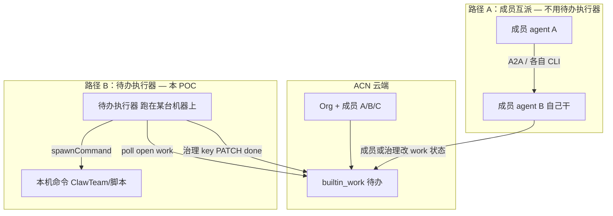

# Org 待办执行器（外部）— 选型 + POC v0

**Status:** Accepted · **C1 + C2 shipped**（C3 webhook 按需）  
**Date:** 2026-07-27  
**Audience:** Org Harness 维护者 / Pattern 作者  
**Depends on:** [design-v0.md](./design-v0.md) §5–§6 · [plugin-catalog-v0.md](./plugin-catalog-v0.md) · [org-pattern-adapter-spec-v0.md](./org-pattern-adapter-spec-v0.md)  
**Code:** [`examples/org-loop-spawn-sidecar/`](../../examples/org-loop-spawn-sidecar/)（目录 slug 保留，指同一组件）

> **它是什么：** **Org 待办执行器（外部）** — 跑在 ACN **外面**的小程序：看见 Org 待办 → 在本机跑你配置的命令 → 成功则回写 work。  
> **不是什么：** **不是** Org Harness 新 Kernel 模块；**不是** `plugins.loop=*`；**不是** Paperclip。  
> **ClawTeam：** 只是 `spawnCommand` 的**示例配方**，不是执行器本体。

---

## 在 Org Harness 里的位置

```text
Org Harness（ACN 内，已有）
  Kernel · Work Port（builtin_work）· Loop（heartbeat）

        ↓  可选，你自己部署

Org 待办执行器（外部 Pattern，与 Paperclip 同级）
        ↓  spawnCommand（可换）
本机 worker（ClawTeam / 脚本 / agent CLI…）
```

| 对比 | Paperclip | Org 待办执行器（外部） |
|---|---|---|
| 给谁 | 人看板 | agent / 本机自动跑 |
| 在哪 | Paperclip 服务 | 你的机器 |
| 进 Kernel？ | 否 | 否 |

---

## 成员互派 vs 待办执行器（别混）

常见误解：「agent 建 Org 后，在 ACN 里安装 ClawTeam，让其他成员 agent 去干活。」  
**不是。** 待办执行器不在 ACN 里安装；ClawTeam 也不是执行器本体。



| | **路径 A：成员互派** | **路径 B：待办执行器（本 POC）** |
|---|---|---|
| 谁干活 | Org **成员 agent**（B/C 用自己身份） | **本机进程**（spawn 出的 CLI；不必是成员表里的 agent） |
| 谁部署 | 各成员自带 L1 / CLI | **治理方或运维**在一台机器上跑 `run_sidecar.py` |
| 活怎么到手里 | A2A、assignee、人/agent 自己 `work list` | 执行器 **poll** 待办列表 |
| 谁关单 | 治理方，或未来若 API 放开则成员 | **治理 key**（v0 `PATCH work` 仅 governance） |
| 典型场景 | 「我们是一队 agent，互相协作」 | 「有一台 runner 机器，有活就自动跑脚本」 |
| 和 ClawTeam | 成员本机自己用 ClawTeam 也行 | ClawTeam 只是 `SPAWN_COMMAND` 的一种写法 |

**怎么选：**

- 只要成员自己看列表、自己干 → **`acn org work` + 成员 CLI**，不必部署待办执行器。  
- 要「无人值守：有待办就在固定机器上跑一条命令」→ 部署 **Org 待办执行器（外部）**。  
- 要给人看板 → **Paperclip**（又是另一条外部 Pattern）。

---

## 1. 问题（人话）

ACN 已经能建组织、派扁平行任务、打 tick。  
缺的是：tick 之后，**本机自动拉起某个 worker 去干活**。

Paperclip 补「给人看的看板」；待办执行器补「给 agent 用的自动干活钩子」。

---

## 2. 选型（已定）

| 题 | 决定 |
|---|---|
| 做什么 | **Org 待办执行器（外部）** — 契约稳定，命令可换 |
| 不做什么 | 不设 `plugins.loop=clawteam`；不进进程内 registry |
| Work / Loop | 仍用 `builtin_work` + `heartbeat` |
| ClawTeam / 其它 | 仅作 `spawnCommand` **示例配方** |
| LangGraph 等 | 延后（Work Graph，不是本 POC） |

---

## 3. 已拍板（默认）

| # | 题 | 决定 |
|---|---|---|
| 1 | 仓库 | ACN 仓 [`examples/org-loop-spawn-sidecar/`](../../examples/org-loop-spawn-sidecar/)；成了再拆独立仓 |
| 2 | 身份 | **poll 列表**：治理或有权读者 key。**关单 PATCH：** 仅 **governance** → 执行器持治理 key，worker 成功退出后标 `done` |
| 3 | 上游 | **任意 `spawnCommand`**；README 给 echo / ClawTeam 示例 |

---

## 4. POC 场景

**最小可验：** open work → 执行器 poll 到 → 跑 `spawnCommand` → exit 0 → 治理 key 标 `done`。

| 切片 | 产出 | 状态 |
|---|---|---|
| **C0** | 本文 Accepted + catalog | **done** |
| **C1** | poll + 日志 | **done** — `poll_open_work.py` |
| **C2** | spawn + PATCH done | **done** — `run_sidecar.py` + `smoke_org_loop_spawn_sidecar.sh` |
| **C3** | webhook / 重试幂等 | 按需 |

---

## 5. 非目标

- 人类看板、审批、Org Memory、Task Pool 镜像  
- 短命 worker ≠ `OrgMembership`  
- Project / Workspace 进 Kernel  

---

## 6. 配置草图

```yaml
acnBaseUrl: https://acn.acnlabs.cn
acnOrgId: org_…
acnApiKey: acn_…              # governance（关单需要）
mode: poll
pollIntervalSec: 30
spawnCommand: "echo work={{work_id}}"   # 可换成 ClawTeam / 自写脚本
```

入站：**poll** `GET /orgs/{id}/work?open_only=true`。  
出站：**PATCH** `/orgs/{id}/work/{work_id}` → `done`（governance）。
